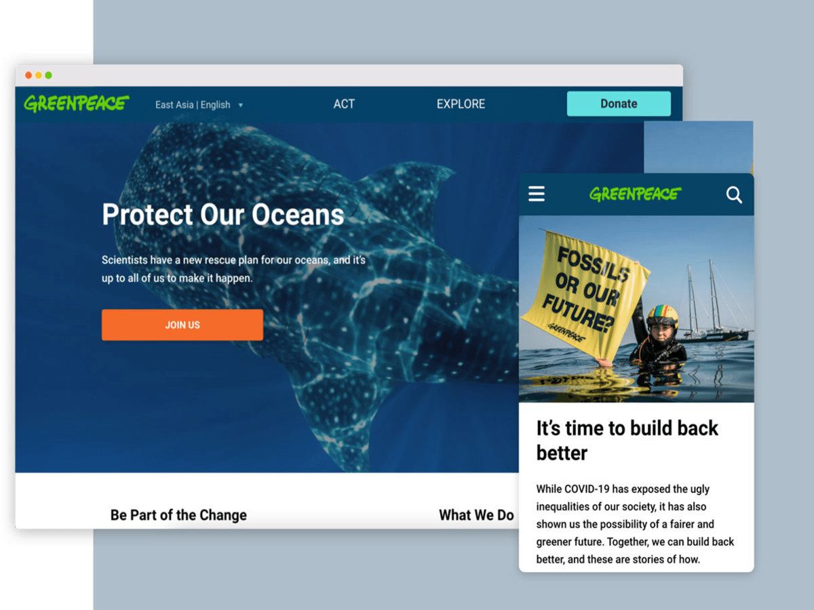

# Greenpeace Planet 4 Master Theme



## Introduction

### What is it?
This is a sample master Wordpress theme to be used for Greenpeace Planet4 project.
You can learn more about this project on [the planet4 blog](https://medium.com/planet4).

This theme is used in planet4 base [wordpress site](https://github.com/greenpeace/planet4-base).
This theme is based on the [`timber/starter-theme`](https://github.com/timber/starter-theme) codebase.
It has a correlated [sample child theme](https://github.com/greenpeace/greenpeace-planet4-child-theme).

## How to use this theme in planet4

You can use the theme in Wordpress directly.
It is already included as a dependency for planet4 base site in composer.json
```
"require": {
    ...
    "greenpeace/planet4-wordpress": "4.7.2",
    "greenpeace/planet4-master-theme" : "0.1.0",
    "greenpeace/planet4-child-theme" : "0.1.2",
    ...
},
```

By default the child theme is used but you can activate the master theme
by specifying it in `wp-cli.yml` like:
```
theme activate:
  - planet4-master-theme
```

You can then run `composer run-script theme:activate` to activate it.

## Development

### Pre-requisite

For development, you will require a couple of tools.

- [nodejs](https://nodejs.org) version >= 6
- [yarn](https://yarnpkg.com/) as npm client, front-end dependency manager
- [Composer](https://getcomposer.org/) as PHP dependency manager

### Setup

0. Clone this repository
```
git clone git@github.com:greenpeace/planet4-master-theme.git && cd planet4-master-theme
```
1. You then need to install the dependencies:
```
npm install
composer install
```

The following packages will be installed as dependencies
- [Twig](http://twig.sensiolabs.org/)
- [Timber](https://timber.github.io/timber/)
- [PostCSS](http://postcss.org/) for automated CSS transformation

### Change the CSS

1. Link this project to your planet4 site to use this theme
    ```
    cd /path/to/planet4-base/public/wp-content/themes
    rm -rf planet4-master-theme
    ln -s /path/to/planet4-master-theme .
    ```
1. Edit the CSS in src/css
1. Rebuild the main.css
    ```
    yarn build
    ```
1. Test it on your local setup
1. If everything is fine, commit your changes
1. Tag your new version
    ```
    git tag -a v0.x.x -m 'v0.x.x'
    git push origin v0.x.x
    ```

### Add a new frontend library

0. Frontend dependencies are stored in `package.json`, handled by yarn. To add a new dependency, e.g. jquery, call:

```
yarn add jquery
```

1. Manually add the new required files to the list of "assets" inside `package.json`, then call gulp:

```
gulp assets
```

2. This will add these files to `assets/lib/`. Then open `functions.php` and add these new assets inside the `enqueue_public_assets` function:

```
wp_enqueue_script( 'jquery', $this->theme_dir . '/assets/lib/jquery/dist/jquery.min.js', array(), '3.3.1', true );
```

### Frontend code linting

We use `stylelint` and `eslint` for checking css and js code syntax.

If you want to test locally use gulp:

```
gulp test
```

### Visual regression testing

We use `BackstopJS` for comparing visual changes and test regressions.

Before you start coding a new frontend feature you should create reference screenshots:

```
gulp backstop_reference --url=http://example.org
```

At any time you can create test screenshots:

```
gulp backstop_test --url=http://example.org
```

Once this is finished a report will be launched in your browser in order to inspect the visual diff.

You can even use different urls for reference and test.
For instance to compare local enviroment with production.
But this may catch some false positives due to potential content differences.
